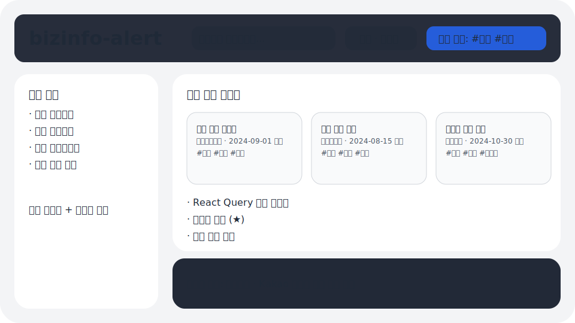

# bizinfo-alert (기업마당 공고 브라우저 v1)


> **참고**: 환경 제약으로 실제 캡처 대신 SVG 기반의 개략도를 제공하여 레이아웃과 인터랙션 구성을 파악할 수 있도록 했습니다.

## 소개
- 기업마당 오픈 API에서 공고를 수집하여 SQLite/Prisma에 저장하고 Next.js(App Router) + React Query + shadcn/ui로 탐색 UI를 제공합니다.
- 검색/필터/정렬, 관심 태그 관리, 북마크, 무한 스크롤과 페이지네이션을 동시에 고려한 UX, 향후 카카오 알림톡 연동을 위한 웹훅 포인트까지 준비되어 있습니다.
- 모든 주요 로직에 한글 주석과 운영/보안 관점 설명이 포함되어 있어 유지보수와 교육에 유리합니다.

## .env 예시
```
BIZINFO_API_KEY=21Ya48
NODE_ENV=development
DATABASE_URL="file:./dev.db"
```

> **보안 주의**: `BIZINFO_API_KEY`는 서버 전용 환경 변수입니다. 클라이언트 번들에 포함되면 API 남용, 쿼터 초과, 비용 발생 위험이 있으므로 Git에 커밋하거나 프런트엔드에서 직접 사용하지 마세요.

## 설치 및 실행
1. 의존성 설치
   ```bash
   npm install
   ```
2. Prisma 마이그레이션 (SQLite DB 생성)
   ```bash
   npx prisma migrate dev --name init
   ```
3. 샘플 데이터 시드
   - Next.js 서버 없이도 `prisma/seed.ts`가 기업마당 API를 직접 호출하여 2페이지 분량 데이터를 채웁니다.
   ```bash
   npx prisma db seed
   ```
   - 또는 서버 실행 후 REST 엔드포인트를 호출하여 원하는 파라미터로 수집할 수 있습니다.
   ```bash
   npm run dev
   npm run import # 내부적으로 POST /api/import 호출
   ```
4. 개발 서버 실행
   ```bash
   npm run dev
   ```
5. 테스트
   ```bash
   npm run test
   ```

## API 키 보안 가이드
- API 키는 `.env`에만 두고 Vercel/서버 환경 변수로 배포하세요.
- 클라이언트 코드나 빌드 산출물에 포함되면 누구든 네트워크 도구로 확인할 수 있습니다.
- 서버 Route Handler(`/api/import` 등)에서만 키를 사용하여 호출하고, 실패 시에는 지수 백오프(0.5s/1s/2s)를 적용해 일시 장애와 레이트 리밋을 흡수합니다.
- CI/CD나 리포지터리에 키를 남기지 않도록 `.gitignore`에 `.env`를 명시했습니다.

## 알림톡 확장 가이드
- 현재 `POST /api/notify-hook`은 `noticeId`, `matchedTags`를 받아 콘솔에 기록만 하지만, 구조는 큐/워커 아키텍처로 확장하기 쉽게 설계되었습니다.
- 권장 아키텍처
  1. 공고 저장/북마크 이벤트 발생
  2. 관심 태그와 자동 태그를 매칭하여 알림 대상 사용자 식별
  3. 메시지를 큐(Kafka, SQS 등)에 적재 후 워커에서 알림톡 대행사 API 호출
  4. 실패 시 재시도/죽은 편지 큐 적용으로 안정성 확보
- 카카오 알림톡 연동 시에는 비즈니스 채널 인증, 템플릿 등록, 발송 톤앤매너 준수, 개인정보/동의 관리 정책을 함께 준비해야 합니다.

## 주요 스크립트
| 명령어 | 설명 |
| --- | --- |
| `npm run dev` | Next.js 개발 서버 실행 |
| `npm run build` | 프로덕션 빌드 |
| `npm run start` | 빌드 산출물 실행 |
| `npm run lint` | ESLint 검사 |
| `npm run test` | Jest + React Testing Library 테스트 |
| `npm run import` | `POST /api/import`를 호출하여 데이터 수집 |

## Docker 구성
- `Dockerfile`과 `docker-compose.yml`을 사용하면 SQLite 볼륨과 환경 변수를 포함한 로컬 개발용 컨테이너를 구성할 수 있습니다.
- `docker-compose up --build` 명령으로 앱 서버와 데이터베이스 볼륨을 동시에 올릴 수 있습니다.

## 폴더 구조 하이라이트
```
app/                 # Next.js App Router 페이지 및 API Route Handler
components/          # UI + 도메인 컴포넌트(shadcn/ui 기반)
lib/                 # 기업마당 API 유틸, Prisma 클라이언트, 데이터 타입
prisma/              # Prisma 스키마 및 seed 스크립트
public/              # 정적 에셋 (스크린샷 포함)
tests/               # Jest 단위/스냅샷 테스트
```

## 추가 메모
- 무한 스크롤과 페이지네이션을 함께 지원하여 SEO와 성능을 동시에 고려했습니다.
- 태그는 NFC 정규화 및 영문 소문자화를 거쳐 중복 저장 문제를 차단합니다.
- 모든 주요 컴포넌트에 한국어 주석과 운영 가이드를 삽입했습니다.
